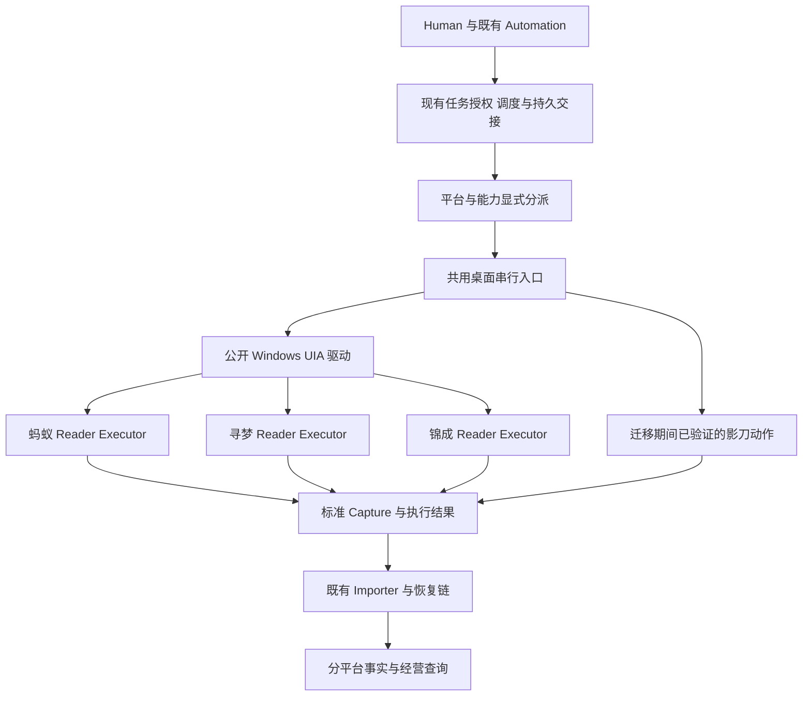

# UIA 多平台接入实施规划

2026-10-07。角色：接入施工与交接计划。范围：蚂蚁花团既有 UIA 能力复用、寻梦与锦成接入、后续平台扩展。阶段状态统一见[当前状态](../project_current_status.md)；本计划不代替 F1/F2/F3 验收或生产切换授权。

## 目标与路线

**新增平台采用直接 Windows UIA，先完成读取到经营查询的最小闭环，再逐动作迁移写执行。** 影刀保留已验证的现役写链，直到对应 UIA 动作完成授权、写前比较、写后回读和恢复验收后退役。采购付费不是当前迁移主因；目标是减少 AI 开发、定位修复和部署过程中的人工接力，以及影刀宿主窗口与元素资产的额外维护。

首批顺序为：**复用蚂蚁基础 → 寻梦只读闭环 → 锦成商品读取及订单补证 → 多平台经营组合 → UIA 写执行迁移**。寻梦已有独立订单页、可读单号及明确终点，适合第二平台验证；锦成商品可先接，订单不能在缺完成证据时冒充完整来源。未勘察的平台进入后续队列，不承诺一个配置就能接入所有小程序。

业务入口为人工经营查询/决定与既有 Automation 任务；出口为可追溯、具备范围和质量的商品/销售事实，及经授权可恢复的执行结果。每个平台只使用一个受控经营账号。正式客户端方向仍为微信小程序；现有 Web 只补必要查询和处置，不扩成另一套长期入口。官方 HTTP API 不作为前置条件。

## 当前依据与可复用程度

| 依据 | 已有能力或事实 | 本计划采用方式 |
|---|---|---|
| main `aaa93497ea2862fc80d303be2aeafc65227d943b` | 主数据/映射、合格观察、Task/operation/attempt、v4/v5、Importer、恢复链；Exposure 与 Physical Inventory 已解耦 | 作为已合并公共边界；不恢复 Exposure 不得超过实物库存的错误限制 |
| F2 本地固定提交 `4c8ce4c77adb100dc0525a71ad3aba7fbb76ea03` | `app/adapters/mayi_huatuan_windows_uia.py`、`mayi_huatuan_uia.py`、`scripts/run_automation_service.py` 已有独立公开 SDK 驱动、有界子进程、心跳/claim、订单和冻结累计 Reader | 作为待整合的实现来源，尚未并入 main；施工前固定并复核上游版本，不复制另一套宿主 |
| 同一 F2 提交的 `docs/plans/task13_7_f1_current_operating_sales_state.md` 第20、23、24节 | 已登录窗口的独立订单驱动与 stock 宿主已有实读；多商品订单有实读核对；冻结累计有允许字段回放与多屏实现 | 不重复从零探索蚂蚁；独立冻结驱动实读、URI冷启动/失效登录等整包场景仍待完成 |
| 同一 F2 提交的 `docs/reports/uia_vs_shadowbot_comparison_20261005.md` | 长期直接 UIA、影刀写链阶段性保留；微信节点变化和关键树缺失是主要兼容性风险 | 本计划承接这一取舍；10月5日探索记录中的影刀主线由本计划更新 |
| [寻梦探索 X01至X24](../reports/xunmeng_platform_discovery_20261005.md) | 商品和普通订单有终点；场次含前晚订单；库存/代卖同面板及补货自动上架 | 第二平台，优先历史订单与商品只读，再验证当前销量口径 |
| [锦成探索 E01至E22](../reports/jincheng_platform_discovery_20261005.md) | 商品总数/补载/终点可核对；成交详情缺明确尾标；价格和渠道多种口径 | 先商品；订单完成证明单列，不让它阻塞其他已合格能力 |

上表 F2 文件在本计划分支尚不存在，因此引用固定提交与仓库路径，不伪造已合并链接。可在共享仓库通过 `git show 4c8ce4c:<路径>` 重现。开发依赖以实际接入时已审查版本为准，当前 PR #65/#66/#67 的远端状态不能代替这些本地新增证据。

## 复用结构

图表示目标分工，不表示公共桌面串行入口或 UIA 写 Executor 已实现。

### 可以共享的部分

从蚂蚁驱动中提取已被第二平台实际需要的桌面检查、窗口枚举、前台确认、COM 生命周期、有界子进程、失效元素重取、采集时限、心跳/停止和脱敏错误传递。解析复用金额、单位等纯函数时，必须保持原字段语义；不把蚂蚁字段顺序作为通用语法。

延续现有 `windows-uia` 可选依赖与已验 SDK 版本；COM 对象留在创建它的子进程，不跨进程传元素句柄，只交接验证后的数据。微软文档说明 UIA 元素会受创建 apartment 生命周期影响，客户端需正确处理失效；现有有界进程设计应据此复用。[Microsoft 线程说明](https://learn.microsoft.com/en-us/windows/win32/winauto/uiauto-threading)

### 必须按平台保留的部分

窗口与活动文档定位、菜单与日期控件、订单卡片、等级/规格、分页、价格口径、单位、截单/显示日期/来源接管、商品写弹窗及副作用范围，分别留在平台 Reader / Adapter / Executor。`Page-Frame` 最后一个就是活动文档只是蚂蚁已观察布局假设，不能机械推广。

使用代码中显式的平台与能力分派，未知平台/动作拒绝启动；新增平台时逐项登记实际支持的商品读、历史订单、当前销售、改价、上下架和可售量能力。优先扩展现有 composition/factory，不建设动态插件市场、选择器 DSL、通用工作流引擎或新配置表。

公共身份仍为 `platform_name + platform_product_identity → internal_sku`。寻梦 UI 名称与既有 `寻梦` 平台值核对别名，锦城/锦成命名先核对主数据；不按窗口标题自动创建重复平台。唯一窗口和当前商品确认是 Adapter 的操作条件，不增加账号、session 或页面认证体系。

## 共用桌面的串行边界

**具体事故：** UIA 读取寻梦日期时，另一个平台导航或影刀改价抢占焦点，可能把键鼠送到错误窗口。平台隔离和 SKU 写锁不能独自防止这件事。

已查源码中，`WindowsMayiHuatuanOrderReader` 的 `threading.Lock` 只保护该对象实例；Queue Service 的单实例锁只保护该服务入口。它们不能证明独立 Automation 进程、其他 Reader 实例与影刀 Worker 已共用一个桌面临界区。这是需要补齐的真实资源互斥缺口，不是新增业务 blocker 的理由。

最小方案是在既有本地宿主/Worker 边界共用一个操作系统级桌面互斥，范围覆盖“取得前台 → 导航/读取或提交 → 结束自有子进程”。先核验是否可扩展现有生命周期锁；不能用实例内锁或任务租约冒充跨进程互斥。所有会导航的 Reader 和影刀执行入口必须接到同一机制，不能只给 UIA 加锁。

- 进程拥有者在存活期间持有互斥；正常结束或确认自有子进程已退出后释放。父进程异常退出也必须保证仍存活的导航子进程不会与新任务重叠，按实际进程生命周期设计并验证。
- 任务继续复用既有持久调度及失败原因，忙碌时有界等待/延期；不另建桌面任务 Queue。现有平台任务锁、幂等、授权和 UNKNOWN 责任保持原范围。
- 桌面互斥释放不等于业务写锁释放。未知写结果仍走唯一 RECONCILE；不能因进程结束就重发写请求。
- 互斥不能阻止人工操作。自动化每一步确认目标前台和商品；焦点被人切走时停止本次自动化，按实际提交阶段分类，不反复争抢焦点。
- 若迁移期不能立即统一影刀入口，先以“无活动任务、明确停止 Worker、确认停止后才进行 UIA 采集”的受控窗口工作。不能仅以当前 Queue 空或时间错峰证明互斥。生产共存以统一互斥或同等受控隔离验收为前提。

这是拟新增的最小本地互斥能力；不需要数据库表、跨平台分布式锁服务或新的状态机。两平台隔离测试必须在第二平台实际启用前完成。

## 第二平台前的经营组合边界

本节落实[路线图](../project_overview.md)“第二平台前完成组合层设计与隔离验收”的要求。允许先做隔离开发及 shadow 读取，进入正式经营来源前必须证明下列合同；F3 仍负责新旧 authority 的实际切换。

| 对象 | 组合规则 | 不满足时的表现 |
|---|---|---|
| Supply 与 Carryover | 农场共享输入；相同日期/商品/单位/覆盖范围只算一次 | 不因增加平台复制一份供给，不把不同阶段供给相加 |
| Current Sales Commitment | 按平台保留来源、经营日、实际覆盖区间、as-of、质量；同范围合格且去重后才汇总 | 只展示已知部分和缺失平台；完整总量保持未知，不补零 |
| 同平台累计与订单 | 沿 F1 既有接管/替换规则；完整订单替换同范围累计 | 不把订单和累计相加；失败时保留最后合格来源及其陈旧状态 |
| 不同平台经营日 | 各自 TimePolicy；不能仅因日期字符串相同就合并，先对齐实际覆盖区间 | 无可证明的共同范围时分平台展示，不按比例分摊 |
| Platform Exposure | 每个平台独立，由 Human 决定；多个平台的可售量之和不是实物预留 | 不新增 Exposure 总量不得超过 Supply 的硬门禁，不自动分配库存 |
| 历史 Closing | 每平台/经营日独立完成、锁定和维护 | 不倒写其他平台当前承诺、供给或实物台账 |
| 故障与健康 | 单平台来源异常只影响该平台及依赖它的组合完整性 | 不无条件停用其他合格平台；共同桌面不可用则实际受影响入口均暂停 |

最小查询在现有页面列出各平台当前商品事实、来源时间/质量、销售承诺与组合是否完整；既有模型不能表达实际必需信息时，先说明具体错误及最小 DTO/caller 变更。默认不新增 Portfolio 表、独立服务或复杂 Allocator。

## 首批平台的能力拆分

| 平台 | 首轮交付 | 必须解决的问题 | 暂不据探索承诺的能力 |
|---|---|---|---|
| 蚂蚁花团 | 复用 F1/F2 订单与冻结累计驱动，补上游剩余实机场景；作为共享层回归样本 | 每次显式选日、过渡日期/旧正文、多商品行金额与重复行、活动页残留 | 不把单平台通过写成多平台宿主通过；18:00与12:00规则不外推 |
| 寻梦 | 商品完整读取 + 指定历史场次普通订单 + importer/查询最小闭环 | 13行探索样本的补载和尾标；O级目录身份；枝/扎规格；普通/代卖范围；待付款/取消是否计入；初始零/空态；场次实际覆盖区间 | 未确认来源接管前不强套蚂蚁冻结累计；净结算、退款和售后不进入首轮销量计算 |
| 锦成 | 商品完整读取、价格/可售量/上下架状态，接到同一查询链 | 供货价/平台售价/结算价分离；全部状态与等级覆盖；稳定身份及总数/终点核对 | 单品成交详情缺明确终点时保留部分/不可用，不导入完整订单；收益权限与开票不属于本轮 |
| 其他平台 | 复用同一勘察模板，先证明1个商品和1段历史订单的读取闭环 | 独立 Windows UIA 是否有业务子树、字段、范围、终点及最小写边界 | 未探索的花伍、珍情、花易宝、花宝宝等不登记为已支持 |

寻梦订单“全部状态”不是有效成交的同义词。未明确取消/未付款和代卖语义时，可完成结构采集与隔离回放，但正式销量来源必须拒绝含未知状态的结果。两平台截单提示只作线索，时间口径可由负责人明确确认与可复现页面样本共同落定，不为重复证明已接受口径持续等待定时采样。

锦成订单若始终无尾标，先寻找平台真实的范围/终点证据。仅当总行数、逐品覆盖和数量/金额对账等替代证明充分时，才提出最小完成合同调整；不能给现有 `no_more_marker_visible` 伪填真，也不能让缺口蔓延成放宽所有平台。

## 分批施工与验收出口

以下编号是本旁路交付批次，不新建 Task13 阶段，也不创建后台工作。F1/F2 上游继续由原实施者维护；每个新增接入批次由承接该批次的开发者负责实现、定向证据与交接。未启动批次由本计划保存依赖和入口。

| 批次 | 输入与工作 | 可审查产物和出口 | 依赖与失败处理 |
|---|---|---|---|
| U0 基线与组合合同 | 固定上游 SHA，确认平台键、能力、TimePolicy/状态口径；核对现有宿主调用点和共享文件 owner | 最小配置/接口清单、上节组合合同对应断言、共享层提取范围；只列有生产风险的新增测试 | 不等待全平台实机才做准备；业务口径不明保留明确缺失，提交负责人一次性裁定 |
| U1 共享 UIA 与桌面隔离 | 从已验驱动提取最小公共能力；显式注册蚂蚁/寻梦，统一导航互斥 | 蚂蚁原路径保持通过；双 Reader/影刀竞争、焦点变化、claim丢失、超时和父子退出证明无重叠；未知平台/动作启动前拒绝 | 不改写成熟 Parser；共享控制有缺陷时不启用第二平台现场共存 |
| U2 寻梦最小纵切 | 先1个映射商品与1个非空历史场次，再覆盖完整列表；UIA→Capture→Adapter→Importer→现有查询 | 同一隔离 Runtime 中与蚂蚁共存；重复请求/重启不重复入库；数量/金额/终点对账；不同平台同名商品不串写 | UIA独立程序必须实读，不把本会话工具采集当后台成功；口径/身份不合格不发布正式销量 |
| U3 锦成接入 | 商品读先闭环；订单按上节补完成证据 | 两平台专属解析与公共宿主分工稳定；锦成商品合格可交付，订单限制在查询中可见 | 无终点不阻塞商品交付，不以空态或汇总伪造订单完成 |
| U4 当前经营与组合 | 分平台完成当前销量来源选择、Closing、质量和经营查询；运行上节组合场景 | 同一 Runtime 中供给只算一次；累计被订单替换；一平台异常时总量不显示伪完整；跨日和重启可继续 | 开发隔离接线可先做，正式接管等待相应 F1/F2 证据及 F3 authority 切换；不另起平行扣减链 |
| U5 UIA 写执行迁移 | 先蚂蚁已验动作对等迁移，再按寻梦/锦成真实表单边界逐动作接入 | 每个“平台+动作”分别证明精确授权、expected old、单次提交、独立回读、持久回执、UNKNOWN/RECONCILE和锁收尾 | 本计划不授权真实写；具体 SKU/动作/旧值/目标/期限/环境到位后执行既有安全链，失败不切另一个 Executor 重写 |
| U6 发布与旧路径退役 | 记录 SDK/驱动/微信/WMPF/小程序可观察版本及合格能力；分平台启用 | 先一个平台一个能力；影刀对应能力退出条件与回退路径清楚；相应完整 Gate 和运维交接完成 | 不整体宣告影刀退役；保留未迁移或仍需收尾的请求/结果消费者；生产切换遵守 F3 和单独授权 |

首个开发提交应限于 U0/U1 的必要部分，并立即用 U2 的寻梦最小链验证抽取是否足够。不要先建完“通用平台框架”再寻找用户路径。其他平台勘察、脱敏 fixture 和纯 Parser 开发可在等待主任务实机时推进；共享宿主和生产桌面操作必须按所有者串行协调。

### 写执行的首轮范围

优先改价、下架，再验证含联动的可售量/上架动作；实际副作用边界未清楚的动作不得进入生产。寻梦库存面板同时有代卖设置、补货可自动上架，编辑页还可能整表带入媒体与评级；不能预设“只改一个数字”。锦成供货价与平台售价/结算价分离，沿管理者真正授权字段执行。

更新前失效是未提交失败；更新后丢失回读或回执是结果不确定，沿旧 attempt 的唯一恢复链核验。选用的 Executor 在一次 attempt 内固定；UIA 失败后不能自动交影刀再点一次。退役只停止新请求分派，历史 in-flight/UNKNOWN 的 importer/reconcile 路径要能完成；不能通过删除旧宿主制造无人负责的非终态。

## 微信更新与故障维护

UIA 客户端能读到什么取决于目标应用 Provider 暴露的树；选择 UIA 并不消除小程序更新风险。[Microsoft Provider 说明](https://learn.microsoft.com/en-us/windows/win32/winauto/uiauto-providersoverview) 公开 SDK 延续项目已验的 [Python UIAutomation for Windows](https://github.com/yinkaisheng/Python-UIAutomation-for-Windows)，不引入 Codex 内部 helper 或绑定交互会话运行时。

| 故障 | 定位与恢复 | 停止条件 |
|---|---|---|
| 节点改名、重排 | 对照脱敏结构/字段关系和目标版本，AI修局部 Reader，回放旧/新样本后独立实读 | 商品/金额/日期或活动文档不能唯一确认时拒绝；不靠绝对索引继续点击 |
| 关键子树消失 | 先排除错窗口、失效登录、锁屏/断连和过渡页；在可支持环境验证实际暴露 | 确认缺树则停受影响能力；改用另一 UIA 封装库不能当作已解决 |
| 刷新空态或日期先变正文未变 | 每次导航后验证范围、稳定字段、加载终点；保留采集区间及刷新前后关系 | 超时/跨来源边界/内容变动不能形成完整快照，不补零 |
| 搜索或过滤残留 | 检查实际可编辑控件及所选范围，清理后回读 | 输入不可读或范围未知则失败；不读取密码、验证码或自动绕过登录 |
| 全屏焦点、断连、子进程卡住 | 停止自有进程并确认退出，保留固定原因，既有宿主继续处理责任 | 不结束微信或解锁桌面；不靠租约超时推断外部写结果 |

兼容性探针复用现有命令入口、健康记录和少量脱敏样本；不新增监控服务。记录微信客户端、实际 WMPF/WeChatAppEx 和小程序可观察版本；取不到的版本明确未知，不拿 UIA 容器数字冒充产品版本。更新后先做目标页面只读核验，合格后恢复受影响能力。图像可辅助导航；未经独立验证的 OCR 金额/数量或影刀捕获不能自动升级为权威事实或写入兜底。

由承接平台适配的开发者负责兼容性诊断与修复，已有 Automation/健康/人工恢复入口暴露当前原因和下一步；需要登录或桌面恢复时交给现场操作者执行具体动作。不新增值班、账号认领或转交体系。

## 验证预算与交付证据

| 风险 | 定向证明 | 复用方式 |
|---|---|---|
| 日期、单位、价格或订单子行误读 | 真实脱敏布局与合成边界回放；未知状态、同订单重复商品、多屏相邻重复/变动、终点和空态 | 扩展现有 UIA/Order/Product fixture，不新增纯文案测试体系 |
| 平台或窗口串用 | 两平台同名SKU、窗口歧义/失效、恢复后重新定位，平台值与请求/结果一致 | 扩展现有 Windows port 和宿主测试；不新增公共页面认证 |
| 桌面抢占与残留子进程 | 两入口并发、影刀共存、父进程中止/子进程存活、claim丢失和超时；确认无后续点击 | 扩展既有生命周期/宿主真实进程 fixture，不能只用 mock lock 证明 |
| 来源重复计量与重启 | 同 Runtime 导入、query、累计→订单接管、平台故障、跨日Closing、重启重用来源 | 复用 F1/F2 真实服务与 importer，供给/实物库存不变断言 |
| 写后不确定 | 失效旧值零副作用、提交后回执丢失、唯一RECONCILE、旧路径退役后收尾 | 复用已有 v4/v5、Task/operation/attempt 与恢复用例，真实写另受有效授权约束 |

每批默认只跑直接测试及一级依赖，超过4个文件、20%或预计2分钟先取得扩大验证授权；全量回归/完整CI/实机矩阵遵守[项目门禁](../../AGENTS.md)，已有同等有效证据不重跑。此次是规划交付，仅做文档 UTF-8、引用、语义和 diff 检查，没有执行 UIA 实机、回归或真实平台操作。

每个平台交付同时报告：实现固定SHA、依赖版本、已支持动作、独立实读覆盖、导入/查询/重启证据、真实写与恢复覆盖、直接限制。维护指标记录人工接力次数、等待时间、节点变化后的修复时间、完整任务耗时和人工恢复次数；不根据单次截图速度或测试数量承诺性能。

规划完成后下一步为 U0/U1 与寻梦最小只读链开发。没有创建后台执行、定时任务或新的真实写请求，也没有替主任务宣告 F1/F2/F3 或 Stage Goal 完成。
