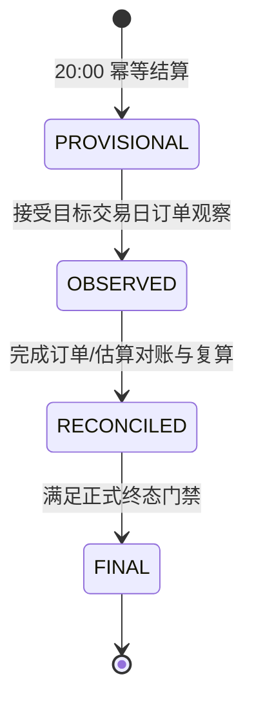

# 任务 13.5-1：双时间轴、六级数据质量与日结状态机冻结合同

- 形成日期：2026-07-29
- 父级权威：[GitHub Issue #20](https://github.com/etereath/PRA-project/issues/20)
- 基线提交：`cb3be04af57e8004396d1cb4b2140e7435842762`
- 工作分支：`codex/task13-5-1-contract-review`
- 合同版本：`TASK13_5_1_CONTRACT_V1`
- 当前状态：`FROZEN`
- 实施门禁：六级质量矩阵与日结状态机已经冻结；后续可以提交 Runtime Schema v14
  迁移和 13.5-1 业务代码，但不得超出本文边界

冻结审查修正：

- `fact_source` 保持 Issue 冻结的两个业务值；无事实使用 NULL，不增加事实级
  `LEGACY`。
- v14 表名使用 Issue 指定的 `automation_jobs`，并纳入
  `incident_notification_state`。
- 汇总质量明确采用覆盖率和最弱关键片段，并保存各事实来源占比。
- v13 Schema 和旧 `TradeWindowService` 基线测试共 14 项通过；新时间合同通过新增
  `OperationalTimeService` 落地，不原地改写旧预测窗口。
- S4 仍属于任务 13.5；最终策略和自动紧急下架继续留在 13.5-6。

## 1. 评审目标与边界

本评审只冻结 13.5-1 编码所需的稳定合同：

1. 18:00 平台交易日、20:00 卖家作业日和三个卖家阶段。
2. `fact_source / quality_level / summary_status` 三个正交维度。
3. 六级数据质量的进入、降级和用途矩阵。
4. `PROVISIONAL → OBSERVED → RECONCILED → FINAL` 唯一正式状态机。
5. 日结版本链、幂等、迟到数据和不可用数据语义。
6. v14 最小逻辑结构、v13 兼容、迁移回滚和验证矩阵。

本评审不冻结：

- 无订单 ID 的最终行指纹和多重集合算法；13.5-4 冻结。
- 库存估算区间的最终资格规则和置信算法；13.5-5 冻结。
- S4 阈值、成本新鲜度、等待周期、次数上限、冷却和人工豁免；13.5-6 冻结。
- 自动化调度的租约、合并和补跑算法；13.5-3 实现，但须遵守本文件的时间合同。
- Web 视觉和页面实现；13.5-8/9 负责。

## 2. v13 现状与兼容结论

### 2.1 现有时间模型不能原地改名

当前 `app/services/trade_window.py` 使用：

```text
trade_open_at       = 前一自然日 23:00
clearance_start_at  = 当日 15:30
trade_close_at      = 当日 17:00
TradePhase          = NORMAL_TRADING | CLEARANCE | CLOSED
```

该模型是既有预测和任务生成决策窗口，不是 Issue #20 定义的平台交易日或卖家作业日。
13.5-1 不得把它直接改成 18:00/20:00，也不得把旧 `TradePhase` 重命名后复用，否则会
静默改变现有预测、任务生成和历史测试语义。

结论：

- 新增唯一的 `OperationalTimeService` 和新枚举 `SellerPhase`。
- 既有 `TradeWindowService / TradePhase` 保持兼容，后续由明确迁移 PR 决定淘汰。
- Web、Automation、观察导入和日结只能调用新服务，不得各自计算日期。

### 2.2 现有 `trade_date` 不能猜测性回填

v13 的 `tasks.trade_date`、`review_tasks.trade_date`、`script_runs.trade_date` 和 Excel
业务表中的 `trade_date` 来源不完全相同；历史记录没有统一的 18:00/20:00 策略版本和
逐条观察时间。

结论：

- v14 保留旧 `trade_date`，不重命名、不删除、不静默解释为 `platform_trade_date`。
- 新业务路径只写显式的 `platform_trade_date / seller_operation_date / seller_phase`。
- 迁移无法证明日期语义的历史记录保持新字段为空，并标记迁移来源；不得从旧 JSON、
  `created_at` 或旧 `trade_date` 猜测。
- 新任务若来自扫描、日结或 Incident，显式日期由来源记录复制并绑定来源 ID；普通旧
  任务继续使用兼容字段，直到对应调用路径迁移。

### 2.3 v13 成功资产保持不变

v14 不改变 v4/v5 请求合同、Importer、receipt、ACK、共享写锁、UNKNOWN 和唯一
RECONCILE。观察、日结和 Automation 通过新表及来源链接扩展，不在既有结果 JSON 或
写动作表中塞入第二套状态机。

## 3. 决策 D1：统一双时间轴服务

### 3.1 输入和输出

新服务的唯一业务入口：

```text
OperationalTimeService.assign(instant, policy_version=None)
→ OperationalContext(
    observed_at_utc,
    local_observed_at,
    timezone_name,
    platform_trade_date,
    seller_operation_date,
    seller_phase,
    time_policy_version,
)
```

强制规则：

- `instant` 必须是带时区的 `datetime`；新业务 API 对 naive datetime 直接报错。
- 技术时间以 UTC 保存；业务日期和阶段由 `Asia/Shanghai` 转换后计算。
- `timezone_name` 固定为 `Asia/Shanghai`，不得使用主机本地时区或当前代码页。
- 每条观察按自己的 `observed_at` 归属；批次起止时间只用于完整性和跨界诊断。
- `policy_version` 必须写入批次、运行和日结；未传入时选择观察时刻生效的唯一策略。

### 3.2 精确边界

```text
platform_trade_date:
  local_time < 18:00  → local_date
  local_time >= 18:00 → local_date + 1 day

seller_operation_date:
  local_time < 20:00  → local_date
  local_time >= 20:00 → local_date + 1 day

seller_phase:
  20:00 <= time < 24:00 或 00:00 <= time < 16:00 → NORMAL_SALES
  16:00 <= time < 18:00                           → PEAK_SALES
  18:00 <= time < 20:00                           → DELIVERY_OVERLAP
```

`SETTLEMENT` 是 Automation 作业类型，不是 `seller_phase`，不得作为第四阶段。

| 本地时刻 | platform_trade_date | seller_operation_date | seller_phase |
| --- | --- | --- | --- |
| 2026-07-29 15:59:59 | 2026-07-29 | 2026-07-29 | `NORMAL_SALES` |
| 2026-07-29 16:00:00 | 2026-07-29 | 2026-07-29 | `PEAK_SALES` |
| 2026-07-29 17:59:59 | 2026-07-29 | 2026-07-29 | `PEAK_SALES` |
| 2026-07-29 18:00:00 | 2026-07-30 | 2026-07-29 | `DELIVERY_OVERLAP` |
| 2026-07-29 19:59:59 | 2026-07-30 | 2026-07-29 | `DELIVERY_OVERLAP` |
| 2026-07-29 20:00:00 | 2026-07-30 | 2026-07-30 | `NORMAL_SALES` |

### 3.3 跨边界批次

- 批次保存 `started_at / completed_at / crossed_platform_cutoff /
  crossed_seller_cutoff`。
- item 保存自己的双日期和阶段。
- 跨越 18:00 的完整扫描不能作为任一交易日的单点截单快照。
- 跨越 20:00 的批次不能把全部 item 强制归到同一卖家作业日。
- 18:00 截单证据由截单前最后一次合格完整扫描和截单后首次合格观察共同证明。
- 跨界批次可以保存并用于轨迹，但是否可用于估算由 13.5-5 的资格合同决定。

## 4. 决策 D2：三个正交维度

### 4.1 `fact_source`

新业务事实只允许：

```text
ORDER_OBSERVED
SCAN_ESTIMATED
```

`fact_source` 不增加第三个 `LEGACY` 值。v13 没有历史销售汇总事实需要迁移；历史
任务的未知来源由 `tasks.origin_type=LEGACY` 表达。没有任何可接受事实时，
`fact_source` 必须为 NULL，并与 `quality_level=UNAVAILABLE` 成对出现，不能伪称
存在订单事实或扫描估算。

### 4.2 `quality_level`

精确值：

```text
ORDER_COMPLETE
ORDER_PARTIAL
SCAN_ESTIMATED_HIGH
SCAN_ESTIMATED_MEDIUM
SCAN_ESTIMATED_LOW
UNAVAILABLE
```

质量在“平台 + 平台交易日 + 汇总范围 + 指标”上评价，不是整个批次的单一标签。例如
一个订单批次可以对平台总量完整，但对存在未映射商品的 SKU 汇总不完整。不得用一个
全局 `ORDER_COMPLETE` 掩盖局部映射缺口。

### 4.3 `summary_status`

精确值：

```text
PROVISIONAL
OBSERVED
RECONCILED
FINAL
```

失败、跳过、不可用、超时和人工阻塞属于 Automation Run、质量等级或 Incident，不得
扩展成第二组日结终态。`FINAL` 是唯一正式终态。

### 4.4 正交约束

- 来源回答“事实怎么得到”。
- 质量回答“事实在当前范围和指标上有多可靠”。
- 状态回答“日结走到哪个审计阶段”。
- 三列独立存储并分别使用 CHECK 约束；`fact_source` 仅在
  `quality_level=UNAVAILABLE` 时允许为 NULL。
- 任何质量等级和状态都不构成平台写授权。
- UI 和报告不得把 `FINAL` 解释为“订单一定完整”；FINAL 的进入门禁已另行确保质量
  满足正式要求。

## 5. 决策 D3：六级数据质量矩阵

### 5.1 进入、降级和用途

| 质量等级 | 必须满足的进入条件 | 主要降级条件 | 日报表现 | 销售计划 | 规则输入 |
| --- | --- | --- | --- | --- | --- |
| `ORDER_COMPLETE` | 最新已接受订单批次覆盖目标交易日；范围、分页/结束标记、必需字段、数量复算和当前汇总范围映射完整 | 覆盖、字段、数量复算、映射或结束标记任一不完整 | 正式订单事实 | 允许 | 仅分析或生成 proposal |
| `ORDER_PARTIAL` | 至少存在一条真实、可接受订单事实，但目标范围存在可明确描述的缺口 | 批次不可接受、没有可用真实行或关键数量完全不可读 | 与完整事实分栏，展示缺口 | 不进入正式计划 | 不允许 |
| `SCAN_ESTIMATED_HIGH` | 相邻合格完整观察；同一平台交易日；VERIFIED 映射；持续在线；库存可读；无未解释调整；数量可复算 | 间隔、价格区间或非关键支撑信息不确定 | 可用但必须标“估算” | 允许 | 仅分析或生成 proposal |
| `SCAN_ESTIMATED_MEDIUM` | 数量仍可解释，但存在有界的时间、价格或扫描间隔不确定 | 关键扫描缺失、未解释库存变化、映射变化或区间资格失效 | 单列并显示不确定区间 | 仅允许降权输入；权重策略由 13.5-5 冻结 | 仅分析，不生成任务 proposal |
| `SCAN_ESTIMATED_LOW` | 仅能给出方向性或宽区间，且仍有可审计支撑观察 | 无法复算方向、观察链断裂或来源不可信 | 低置信附注，不计入正式合计 | 不允许 | 不允许 |
| `UNAVAILABLE` | 无可接受订单事实，也无满足最低资格的扫描估算；或能力/目标日期当前不可用 | — | 明确显示不可用，不伪造 0 | 不允许 | 不允许 |

### 5.2 来源和质量合法组合

| `fact_source` | 允许的 `quality_level` |
| --- | --- |
| `ORDER_OBSERVED` | `ORDER_COMPLETE`、`ORDER_PARTIAL` |
| `SCAN_ESTIMATED` | `SCAN_ESTIMATED_HIGH`、`SCAN_ESTIMATED_MEDIUM`、`SCAN_ESTIMATED_LOW` |
| NULL | `UNAVAILABLE` |

非法组合必须由模型、Repository 和数据库 CHECK 同时拒绝。

### 5.3 选择和展示规则

1. 同一范围存在 `ORDER_COMPLETE` 时，正式销量和卖家实收以订单事实为主；扫描估算
   作为对账输入保留，不与订单事实相加。
2. `ORDER_PARTIAL` 与扫描估算可以并列展示和对账，不允许未经解释择一或相加。
3. 不同扫描批次是重复观察，不是新增销量；只能选择满足资格的区间或最新接受批次。
4. `UNAVAILABLE` 不是 0；数量、金额和订单数保持空值，并记录原因码。
5. 商品未映射、映射歧义和范围外事实不得进入 SKU 精确合计；平台总量是否可用按该
   汇总范围自己的完整性重新评价。
6. 汇总质量按覆盖率和最弱关键片段计算，不能用高质量片段平均掉阻断片段；同时保存
   各事实来源的数量、金额或覆盖占比，供日报解释和对账。
7. S4 后续使用独立的完整价格观察、成本门禁和版本化策略；销售质量枚举不能替代
   S4 价格与成本门禁，也不能单独触发 `SYSTEM_EMERGENCY`。
8. “允许进入销售计划”不等于允许创建平台写任务；计划输入、proposal、Review 和
   写授权继续分层。

## 6. 决策 D4：日结状态机



允许的常规转换只有：

```text
PROVISIONAL -> OBSERVED
OBSERVED -> RECONCILED
RECONCILED -> FINAL
```

禁止：

- 回退状态。
- 跳过中间状态。
- 直接修改 `FINAL`。
- 用 `FAILED / CANCELLED / UNAVAILABLE` 扩展 `summary_status`。
- 因重复执行创建多个同版本当前汇总。

### 6.1 `PROVISIONAL`

20:00 结算作业为刚结束的平台交易日创建。进入条件：

- 唯一逻辑 settlement run 已取得租约并完成输入选择。
- 保存实际输入事实、质量、时间策略版本和内容 hash。
- 有合格扫描估算时使用 `SCAN_ESTIMATED`；没有可用事实时仍可创建
  `fact_source=NULL`、`quality_level=UNAVAILABLE` 的空值汇总。
- 数量和金额不可用时必须为 NULL，不得写 0。
- 生成下一销售计划输入时只使用质量矩阵允许的组件。

### 6.2 `OBSERVED`

进入条件：

- 已接受目标平台交易日的不可变订单观察批次。
- 实际查询日期范围、页面范围、完整性和结束标记已记录。
- 重复批次选择规则产生唯一当前输入，不跨批次累加销量。
- `fact_source=ORDER_OBSERVED`。
- 质量可以是 `ORDER_COMPLETE` 或 `ORDER_PARTIAL`；无真实可用行时不得进入
  OBSERVED。

### 6.3 `RECONCILED`

进入条件：

- OBSERVED 输入和可用扫描估算均已绑定，或明确记录扫描估算不可用。
- 数量、金额、时间桶、品种、等级和 SKU 汇总可从绑定输入自动复算。
- 订单与估算差异已分类为已解释、接受偏差或 Incident，不存在未分类差异。
- 所有输入 hash、映射版本和对账算法版本已记录。
- RECONCILED 表示“完成对账”，不自动提升质量；`ORDER_PARTIAL` 仍保持部分质量。

### 6.4 `FINAL`

进入条件必须同时满足：

- 当前版本已是 `RECONCILED`。
- 正式汇总范围的质量为 `ORDER_COMPLETE`。
- 关键数量与卖家实收金额复算通过。
- 没有阻断日结的未解决 Incident 或未分类差异。
- 状态转换由明确的 finalization policy/version 执行并写入审计事件。

若订单长期不可用或只能达到 `ORDER_PARTIAL`，汇总保持非 FINAL 并创建/维持 Incident；
不得为了关闭日报而人工强制标记 FINAL。

## 7. 决策 D5：版本、迟到数据与幂等

### 7.1 逻辑身份

日结系列自然范围：

```text
platform_name
+ platform_trade_date
+ scope_type
+ scope_key
```

其中 `scope_type` 首期至少支持：

```text
PLATFORM
VARIETY
GRADE
SKU
TIME_BUCKET
```

`scope_key` 使用稳定内部键；平台商品显示名不能直接充当 SKU 级长期键。

### 7.2 版本链

每个系列保存：

```text
summary_id
summary_series_id
version_no
supersedes_summary_id
is_current
```

- 同一系列最多一个 `is_current=1`。
- 创建新版本、撤销旧 current 和写入来源链接必须位于同一事务。
- `FINAL` 后到达迟到订单或人工修正时，旧 FINAL 保持不可变。
- 新版本以 `OBSERVED` 开始，`supersedes_summary_id` 指向旧 FINAL，再经过
  `RECONCILED → FINAL`。
- 未到 FINAL 的重复输入若内容 hash 不变，只记录幂等事件，不增加版本。
- 输入事实、映射版本、算法版本或金额/数量发生实质变化时才创建新版本。

### 7.3 状态事件

所有转换写入不可变 `platform_trade_day_summary_events`：

```text
event_id
summary_id
from_status
to_status
trigger_type
trigger_ref_id
fact_source_before / fact_source_after
quality_level_before / quality_level_after
input_manifest_sha256
changed_at
changed_by
reason
```

失败发生在事务提交前时，不得留下半转换；失败运行保存在 Automation Run/Event 和
Incident 中。

## 8. 决策 D6：v14 最小逻辑结构

### 8.1 时间策略

`operational_time_policies` 最少包含：

```text
policy_version
timezone_name
platform_cutoff_local_time
seller_cutoff_local_time
peak_start_local_time
effective_from
effective_to
created_at
created_by
supersedes_policy_version
```

首个策略版本冻结为 `CN_SINGLE_PLATFORM_2026_V1`。同一时刻只能有一个生效策略；修改
必须创建新版本，不能原地覆盖。

### 8.2 Automation 核心

v14 建立最小账本：

- `automation_jobs`
- `automation_runs`
- `automation_run_events`
- `automation_run_links`

`automation_runs` 必须显式保存双日期、阶段、计划时间、实际时间、策略版本和状态。
`script_runs` 保持兼容，不改名；二者通过迁移说明和可选 link 对齐，不复制历史 JSON
猜测来源。详细租约与调度算法由 13.5-3 实现。

### 8.3 不可变观察

- `product_observation_batches`
- `product_observation_items`
- `order_observation_batches`
- `order_observation_items`

批次保存请求范围、能力结果、完整性、hash、时间策略和 Importer 状态；item 使用代理
主键并保存逐条双日期。13.5-1 不建立会把订单指纹当绝对身份的唯一索引；13.5-4 再
冻结 `source_row_fingerprint / occurrence_no / occurrence_count` 的最终约束。

### 8.4 销售和日结

- `sales_estimate_segments`
- `platform_trade_day_summaries`
- `platform_trade_day_summary_events`
- `platform_trade_day_summary_inputs`

`platform_trade_day_summaries` 至少保存三个正交维度、系列/版本、双日期、范围、数量、
金额、质量原因、各来源占比、输入 manifest hash、映射/算法/时间策略版本和 current
标志。`fact_source` 只在 `quality_level=UNAVAILABLE` 时允许 NULL；数量、金额和订单
数必须允许 NULL，以表达 `UNAVAILABLE`。

### 8.5 Incident 核心

v14 建立：

- `operational_incidents`
- `incident_notification_state`

`operational_incidents` 只冻结通用身份、来源、等级、状态和时间关系，供不完整数据和
日结阻断使用；`incident_notification_state` 保存最低限度的通知去重、最近通知时间和
待升级状态，不在 13.5-1 固化最终提醒渠道或升级策略。Incident 人工闭环在 13.5-6
完成；不得在 v14 提前创建最终 `emergency_action_policies`。

### 8.6 现有任务扩展

`tasks` 增加：

```text
origin_type
origin_ref_id
approval_policy
policy_version
platform_trade_date
seller_operation_date
seller_phase
time_policy_version
```

`origin_type` 首期允许：

```text
MANUAL
AUTOMATION
SYSTEM_EMERGENCY
LEGACY
```

`SYSTEM_EMERGENCY` 仅为扩展边界；13.5-1 不创建、批准或执行紧急任务。历史任务迁移为
`origin_type=LEGACY`，其他新字段保持 NULL，除非存在结构化来源可证明。

## 9. 决策 D7：迁移与回滚

### 9.1 v13→v14

- 迁移在 `BEGIN IMMEDIATE` 内执行。
- 执行前要求 SQLite 在线备份和校验记录。
- 新表先创建，再添加兼容列和索引，最后写入 schema 版本。
- 旧 v4/v5 batch、operation、attempt、receipt、ACK、写锁和 UNKNOWN 行不重写。
- 历史 `trade_date` 不回填新双日期。
- 历史 task 只回填 `origin_type=LEGACY`；不解析 `decision_trace_json` 猜来源。
- 历史 `script_runs` 不复制为 automation run；保留原表，通过兼容查询展示。
- `listing_sync_snapshots` 保持任务 13 权威；新观察投影只能通过显式迁移服务或后续新
  Importer 写入，不能在 schema migration 中猜测逐项业务语义。

### 9.2 回滚

- 迁移失败必须回滚事务且保持 schema version 13。
- 失败后恢复 `PRAGMA foreign_keys=ON`，运行 `foreign_key_check` 和
  `integrity_check`。
- 已成功迁移后的业务回滚优先使用迁移前备份；不得通过删除 v14 表假装无损降级。
- 重复执行 `init_schema()` 必须幂等，不重复插入时间策略或 LEGACY 来源事件。

## 10. 决策 D8：验证矩阵

### 10.1 时间

- 15:59:59、16:00:00、17:59:59、18:00:00、19:59:59、20:00:00。
- UTC 输入、`+08:00` 输入和其他合法时区输入归属一致。
- naive datetime 被拒绝。
- 跨 18:00、跨 20:00 和同时跨两个边界的批次逐项归属。
- 策略版本生效边界和无重叠约束。
- 既有 `TradeWindowService` 回归不变。

### 10.2 质量

- 六级每个进入条件和主要降级条件。
- 每个来源/质量合法组合和非法组合。
- 同一批次在 PLATFORM 与 SKU 范围得出不同质量。
- `UNAVAILABLE` 保持 NULL，不写 0。
- 不同扫描批次不累加。
- ORDER 和 SCAN 同时存在时不重复计数。
- 质量允许计划输入但不形成写授权。

### 10.3 状态机

- 三条允许转换。
- 回退、跳级、FINAL 修改和非法状态被拒绝。
- 重复同输入幂等。
- FINAL 后迟到数据创建 OBSERVED 新版本并形成 supersedes 链。
- 同一系列 current 唯一。
- 转换事务失败不留下半状态或半事件。
- ORDER_PARTIAL 可以 RECONCILED，但不能 FINAL。
- 长期 UNAVAILABLE 保持非 FINAL 并关联 Incident。

### 10.4 Schema

- 新库初始化到 v14。
- 带真实 v13 结构和代表性数据的 v13→v14。
- 重复迁移。
- 每个迁移阶段故障注入和事务回滚。
- 外键、CHECK、部分唯一索引和 NULL 语义。
- 历史任务只获得 LEGACY 来源，不猜日期。
- 历史 v4/v5、写锁、UNKNOWN、receipt 和 ACK 回读不变。
- Runtime Schema health 精确检查 v14 表、列、索引和约束。

## 11. 评审通过条件

以下项目已在 Issue #20 权威正文、v13 代码事实和本轮冻结审查之间完成确认：

- [x] D1 双时间轴输入、边界、阶段和跨界语义已接受。
- [x] D2 三个正交维度、UNAVAILABLE 的 NULL 来源及任务迁移专用 `origin_type=LEGACY`
  已接受。
- [x] D3 六级质量进入、降级、日报、计划和规则用途已接受。
- [x] D4 唯一日结状态机和 FINAL 门禁已接受。
- [x] D5 版本链、迟到数据、current 唯一和幂等规则已接受。
- [x] D6 v14 最小逻辑结构和延后冻结边界已接受。
- [x] D7 v13 兼容、无猜测回填和备份回滚规则已接受。
- [x] D8 时间、质量、状态机、迁移和失败注入矩阵已接受。
- [x] 确认 13.5-1 不冻结最终 S4 策略，也不实现自动紧急下架。
- [x] 确认质量、日结状态和 `SYSTEM_EMERGENCY` 来源均不构成写授权。

## 12. 编码后的 13.5-1 验收出口

评审冻结后，编码 PR 至少交付：

1. `OperationalTimeService`、枚举和纯边界测试。
2. Runtime Schema v14、新模型、Repository 和精确健康检查。
3. v13→v14、重复迁移、失败回滚和代表性历史兼容测试。
4. 三个正交维度、六级组合约束和日结转换服务。
5. FINAL 后版本化修订、状态事件和输入 manifest hash。
6. 临时数据库 smoke、完整 pytest、Windows/Linux CI 和 wheel 验证。
7. 更新后的 Schema 报告、迁移运行手册和 13.5-2 输入合同。

上述出口不包含 Scheduler、订单实机采集、销售估算算法、S4 自动保护或 Web 重写。
